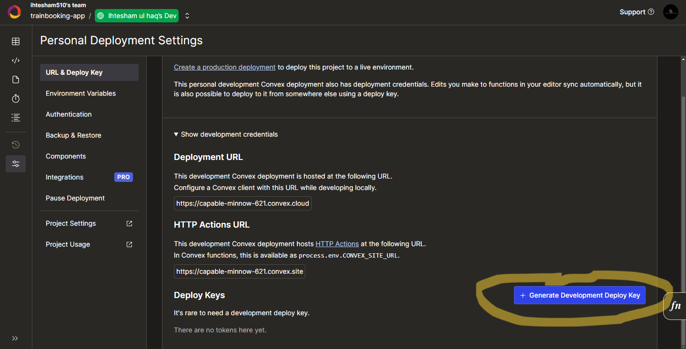
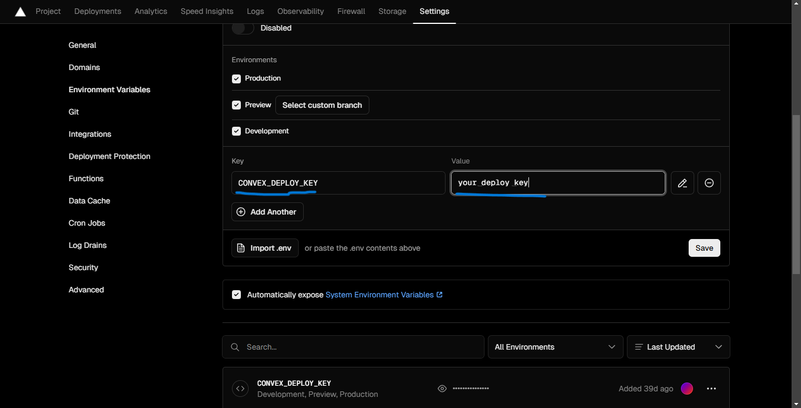
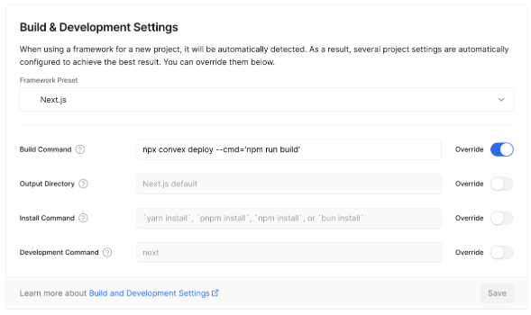

# Train Booking Management System

- User Auth
  - [x] User Can Sign in with Email and password
  - [x] User Can Sign in with Phone_no and password
  - [x] User Can Sign in with Username and password
  - [x] User Encrypted `_id` will be stored in the localstorage of browser, so that when the user refreshes the page it will look up for the user in database using the encrypted `_id`
  - [x] User password will be encrypted and stored in the database.
  - [x] While Signing in and Signing up the Username , Phone_no and Email will be checked weather the user is authenticated or not.
  - [x] Validation for email , password , Phone_no, Username while signing in and signing up is enabled

# How to dev

install the pnpm

```bash
npm i -g pnpm
```

Install dependencies

```bash
pnpm install

```

---

Make sure you have a Github Account and you are logged-in in convex

```bash
pnpm dev
```

# How to Deploy

Make sure a vercel account.

Create a new project.

Go to your convex project dashboard head to Project-setting>URL & Deploy Keys and hit generate Deployment deploy key.



Copy the key generated.

Head to your environment variables and paste the following environment variable.



Override the build command


